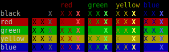
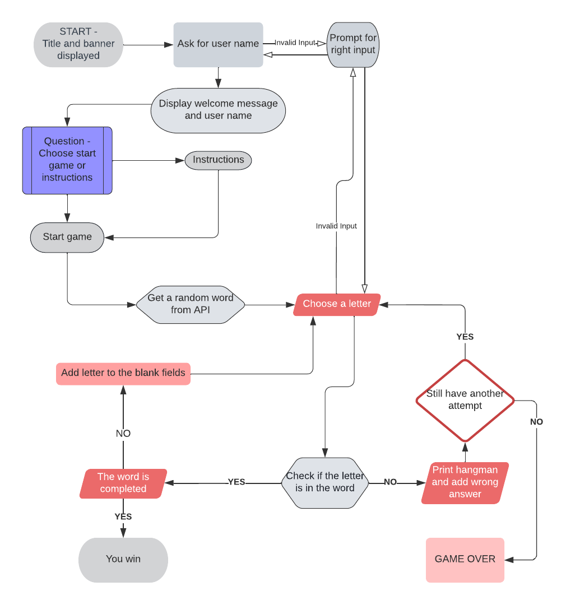

# CI Hangman Game

[Access the Live CI Hangman Game Website here](https://#) (Ctrl + Click to open on a new tab)

## Table of Contents
1. [**UX**](#ux)
    - [**Purpose of the project**](#purpose-of-the-project)
    - [**User stories**](#user-stories)
    - [**Features**](#features)
    - [**Future features**](#future-features)

2. [**Typography and color scheme**](#typography-and-color-scheme)

3. [**Fluxogram**](#fluxogram)

4. [**Technologies Used**](#technologies-used)
    - [**Code validation**](#code-validation)
    - [**Test cases (user story based with screenshots)**](#test-cases)
    - [**Fixed bugs**](#fixed-bugs)
    - [**Supported screens and browsers**](#supported-screens-and-browsers)

5. [**Deployment**](#deployment)
    - [**Via Gitpod**](#via-gitpod)
    - [**Via Github Pages**](#via-github-pages)
6. [**Credits**](#credits)

---

## UX

Welcome fellow visitor,

This is the CI Hangman Game. It's a Python terminal game, which runs on the Code Institute mock terminal on Heroku and generates a random word that the user can discover finding the correct letters.

## Purpose of the project

The website is created to provide a fun the terminal environment made with Python language. Our goal is to give the user a game that can be both challenging and fun!

This website is made of the following sections:

  1. Welcome banner.
  2. Instructions to play the game.
  3. Game.

The business goal for this website is to give the user a fun and challenging game.

This game is created for anyone who wants to have fun playing a word game. Also this game is a good introduction to the terminal window for anyone who is not familiar with terminal environment. The target users are:

  - People of all ages.
  - Interested in playing a game that is challenging and fun at the same time.
  - Interested in enjoy playing word game.

What these users would be looking for:

  - A game that can be played to pass time without being too stressful.
  - A game hangman game with random words to be discovered.
  - Win the game and get winning message when it is achieved.
  - Having clear feedback for their action.

This game was crafted using the mock terminal setting provided by Code Institute's template. It was created to give birth to the Tirdth "Portfolio Project" to complete as part of the Diploma in Full Stack Software Development course at Code Institute in Dublin, Republic of Ireland.

## User stories

- As a **visitor**, I can have a clear instruction on what's the game objective and process.
- As a **visitor**, I can have a clear feedback for my actions.
- As a **visitor**, I can have a graphical display as a fun factor.
- As a **visitor**, I can have a quick response time.
- As a **visitor**, I can have a feedback for every input.
- As a **visitor**, I can get random words for the challenge.
- As a **visitor**, I can get random words for the challenge.
- As a **visitor**, I can get the choice to skip the instruction and start the game.

## Features

The game has the following features:

 - Display greetings with user name
 - Display the instruction when user opts for
 - Category choice user can select from
 - Playing the game
 - Choice to play again or exit the game

## Future features

  - For the future deployments to the game, I would like to implement a option to the user select types or groups of words;
  
  - Besides, I would like to implement a validation of the word to verify if the random word provided by the API is a real word;

## Typography and color scheme

 - I have created variables to color my texts to make it easier for the user to read the story. For colors I have used colorama.

  

 - For the text on the banner and ending messages, I used Pyfiglet that create fancy texts with large fonts & sizes in the output.

## Fluxogram

This website was first planned from scratch on Lucidchart with the free license for trial as can be seen by the fluxogram below.

  

Please note the actual website has changed slightly from these wireframes.

## Technologies Used

I have used several technologies that have enabled this game to work:

  - [GitHub](https://github.com/)
    - Used to store code for the project after being pushed.
  - [Git](https://git-scm.com/)
    - Used for version control by utilising the Gitpod terminal to commit to Git and Push to GitHub.
  - [Gitpod](https://www.gitpod.io/)
    - Used as the development environment.
  - [AmIResponsive](http://ami.responsivedesign.is/)
    - Used to generate repsonsive image used in README file.
  - [Pyfiglet](https://pypi.org/project/pyfiglet/0.7/)
    - Python module that comes with many functions, and we can use these functions in a Python program to create fancy texts with large fonts & sizes in the output.
  - [Colorama](https://pypi.org/project/colorama/)
    - Built-in Python module to display the text in different colors. It is used to make the code more readable. Three formatting options are available in this module for coloring text.

## Code validation

## Test cases

## Fixed bugs 

## Supported screens and browsers

## Deployment 

## Via Gitpod 

## Via Github Pages

## Credits 