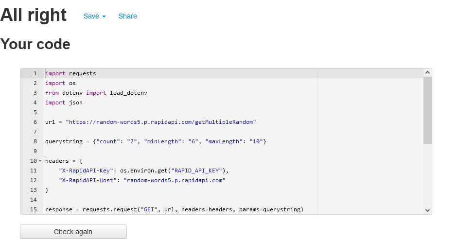
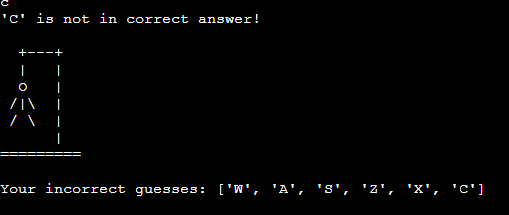

# CI Hangman Game

[Access the Live CI Hangman Game Website here](https://ci-portfolio3.herokuapp.com/) (Ctrl + Click to open on a new tab)

## Table of Contents
1. [**UX**](#ux)
    - [**Purpose of the project**](#purpose-of-the-project)
    - [**User stories**](#user-stories)
    - [**Features**](#features)
    - [**Future features**](#future-features)

2. [**Typography and color scheme**](#typography-and-color-scheme)

3. [**Fluxogram**](#fluxogram)

4. [**Technologies Used**](#technologies-used)
    - [**Code validation**](#code-validation)
    - [**Test cases (user story based with screenshots)**](#test-cases)
    - [**Fixed bugs**](#fixed-bugs)
    - [**Supported screens and browsers**](#supported-screens-and-browsers)

5. [**Deployment**](#deployment)
    - [**Using Github and Gitpod**](#using-github-and-gitpod)
    - [**Creating an Application with Heroku**](#creating-an-application-with-heroku)
6. [**Credits**](#credits)

---

## UX

Welcome fellow visitor,

This is the CI Hangman Game. It's a Python terminal game, which runs on the Code Institute mock terminal on Heroku and generates a random word that the user can discover finding the correct letters.

## Purpose of the project

The website is created to provide a fun the terminal environment made with Python language. Our goal is to give the user a game that can be both challenging and fun!

This website is made of the following sections:

  1. Welcome banner.
  2. Instructions to play the game.
  3. Game.

The business goal for this website is to give the user a fun and challenging game.

This game is created for anyone who wants to have fun playing a word game. Also this game is a good introduction to the terminal window for anyone who is not familiar with terminal environment. The target users are:

  - People of all ages.
  - Interested in playing a game that is challenging and fun at the same time.
  - Interested in enjoy playing word game.

What these users would be looking for:

  - A game that can be played to pass time without being too stressful.
  - A game hangman game with random words to be discovered.
  - Win the game and get winning message when it is achieved.
  - Having clear feedback for their action.

This game was crafted using the mock terminal setting provided by Code Institute's template. It was created to give birth to the Tirdth "Portfolio Project" to complete as part of the Diploma in Full Stack Software Development course at Code Institute in Dublin, Republic of Ireland.

## User stories

- As a **visitor**, I can have a clear instruction on what's the game objective and process.
- As a **visitor**, I can get the choice to skip the instruction and start the game.
- As a **visitor**, I can get random words for the challenge.
- As a **visitor**, I can have a clear feedback for my actions.
- As a **visitor**, I can have a graphical display as a fun factor.
- As a **visitor**, I can have a quick response time.
- As a **visitor**, I can have a feedback for every input.

## Features

The game has the following features:

 - Display greetings with user name
 - Display the instruction when user opts for
 - Category choice user can select from
 - Playing the game
 - Choice to play again or exit the game

## Future features

  - For the future deployments to the game, I would like to implement a option to the user select types or groups of words;
  
  - Besides, I would like to implement a validation of the word to verify if the random word provided by the API is a real word;

## Typography and color scheme

 - I have created variables to color my texts to make it easier for the user to read the story. For colors I have used colorama.

  

 - For the text on the banner and ending messages, I used Pyfiglet that create fancy texts with large fonts & sizes in the output.

## Fluxogram

This website was first planned from scratch on Lucidchart with the free license for trial as can be seen by the fluxogram below.

  

Please note the actual website has changed slightly from these wireframes.

## Technologies Used

I have used several technologies that have enabled this game to work:

  - [Python 3](https://www.python.org/)
    - Used as main programing language to develop the script for the game.
  - [GitHub](https://github.com/)
    - Used to store code for the project after being pushed.
  - [Git](https://git-scm.com/)
    - Used for version control by utilising the Gitpod terminal to commit to Git and Push to GitHub.
  - [Gitpod](https://www.gitpod.io/)
    - Used as the development environment.
  - [AmIResponsive](http://ami.responsivedesign.is/)
    - Used to generate repsonsive image used in README file.
  - [Pyfiglet](https://pypi.org/project/pyfiglet/0.7/)
    - Python module that comes with many functions, and we can use these functions in a Python program to create fancy texts with large fonts & sizes in the output.
  - [Colorama](https://pypi.org/project/colorama/)
    - Built-in Python module to display the text in different colors. It is used to make the code more readable. Three formatting options are available in this module for coloring text.
  - [RapidAPI](https://rapidapi.com/)
    - Used to provide an API that generates a random word.
  - [PEP8 online check](http://pep8online.com/)
    - Used to validate all python code written and used in this game.

## Code validation

- For validation purposes I used [PEP8 online check](http://pep8online.com/):
  - ### run.py PEP8 test
    

  - ### welcome.py PEP8 test
      
  
  - ### word.py PEP8 test
    
  
  - ### typingMode.py PEP8 test
    
  
  - ### ending.py PEP8 test
    

## Test cases

1. **As a visitor, I can get the choice to skip the instruction and start the game.**
  - The game begins showing the banner to the user.
  - The game ask for the user to input his name.
  - If the user provide a number or an empty input, an error is displayed.
  - The user provides a name and a welcome message is displayed.
  - The game ask to the user if he wants to check the instructions by pressing "y" or start the game by pressing any other key.

  

2. **As a visitor, I can have a clear instruction on what's the game objective and process.**
  - The game ask to the user if he wants to check the instructions by pressing "y" or start the game by pressing any other key.
  - The user type "y" and press enter.
  - The instructions are displayed to the user.

  

3. **As a visitor, I can get random words for the challenge.**
  - The game ask to the user if he wants to check the instructions by pressing "y" or start the game by pressing any other key.
  - The user type any other key or just press enter.
  - A random word is provided by an API.
  - A message asking for a letter is displayed to the user.

  

4. **As a visitor, I can have a clear feedback for my actions.**
  - The game ask the user to input a letter.
  - If the user provide more than one letter, or a number, or a empty input, an error is displayed.
  - The user provides one letter.
  - If the letter belongs in the random word, the a feedback message is displayed informing the user that it's a correct letter.
  - If the letter does not belong in the random word, the a feedback message is displayed informing the user that it's a wrong letter.

  

  

5. **As a visitor, I can have a graphical display as a fun factor.**
  - The wrong answers from the user are indicated by the hangman image that is built by pieces over the console.
  - When the user wins the game, a graphycal text is shown in blue.
  - When the user looses the game, a graphycal text is shown in red.

  
  
  
  
  

## Fixed bugs 

- Bug: One bug was fund when re-palying the game. The issue was: the word was generated only one time when the code was loaded and the same word was stored in the variable even when the user select the option to replay the game at the end. 

- Fix: The root cause of this issue was found on the file "word.py" that contains the function requesting the random word from the API. The `response` variable that makes the actual request to the API was outside the function `getWord()`. To fix the issue I moved the request to inside the function `getWord()` and the request is made everytime that the function is called and a new random word is returned.

## Supported screens and browsers

- The website is fully responsive and can be accessed on smartphones (width of 600px and smaller), tablets (width of 820px and smaller) and monitors of any size.

- The website was tested and is supported on the browsers Google Chrome, Mozilla Firefox, Microsoft Edge, Opera and Brave.

## Deployment 

The main branch of this repository has been used for the deployed version of this application.

### Using Github and Gitpod

To deploy my command-line interface application, I had to use the [Code Institute Python Essentials Template](https://github.com/Code-Institute-Org/python-essentials-template), as this enables the application to be properly viewed on Heroku using a mock terminal. 

- Click the `Use This Template` button.
- Add a repository name and brief description.
- Click the `Create Repository from Template` to create your repository.
- To create a Gitpod workspace you then need to click `Gitpod`, this can take a few minutes.
- When you want to work on the project it is best to open the workspace from Gitpod (rather than Github) as this will open your previous workspace rather than creating a new one. You should pin the workspace so that it isn't deleted.
-  Committing your work should be done often and should have clear/explanatory messages, use the following commands to make your commits:
    - `git add .`: adds all modified files to a staging area
    - `git commit -m "A message explaining your commit"`: commits all changes to a local repository.
    - `git push`: pushes all your committed changes to your Github repository.

*Forking the GitHub Repository*

If you want to make changes to your repository without affecting it, you can make a copy of it by 'Forking' it. This ensures your original repository remains unchanged.

1. Find the relevant GitHub repository
2. In the top right corner of the page, click the Fork button (under your account)
3. Your repository has now been 'Forked' and you have a copy to work on

*Cloning the GitHub Repository*

Cloning your repository will allow you to download a local version of the repository to be worked on. Cloning can also be a great way to backup your work.

1. Find the relevant GitHub repository
2. Press the arrow on the Code button
3. Copy the link that is shown in the drop-down
4. Now open Gitpod & select the directory location where you would like the clone created
5. In the terminal type 'git clone' & then paste the link you copied in GitHub
6. Press enter and your local clone will be created.

### Creating an Application with Heroku

I followed the below steps using the Code Institute tutorial:

- The following command in the Gitpod CLI will create the relevant files needed for Heroku to install your project dependencies `pip3 freeze --local > requirements.txt`. Please note this file should be added to a .gitignore file to prevent the file from being committed.

1. Go to [Heroku.com](https://dashboard.heroku.com/apps) and log in; if you do not already have an account then you will need to create one.
2. Click the `New` dropdown and select `Create New App`.
3. Enter a name for your new project, all Heroku apps need to have a unique name, you will be prompted if you need to change it.
4. Select the region you are working in.

*Heroku Settings*
You will need to set your Environment Variables - this is a key step to ensuring your application is deployed properly.
- In the Settings tab, click on `Reveal Config Vars` and set the following variables:
    - If using credentials you will need to add the credentials as a variable, the key is the name 'CREDS' and the value is the contents of your creds JSON file.
    - Add key: `PORT` & value `8000`
- Buildpacks are also required for proper deployment, simply click `Add buildpack` and search for the ones that you require.
    - For this project, I needed to add `Python` and `Node.js`, in this order.

*Heroku Deployment*
In the Deploy tab:
1. Connect your Heroku account to your Github Repository following these steps:
    - Click on the `Deploy` tab and choose `Github-Connect to Github`.
    - Enter the GitHub repository name and click on `Search`.
    - Choose the correct repository for your application and click on `Connect`.
2. You can then choose to deploy the project manually or automatically, automatic deployment will generate a new application every time you push a change to Github, whereas manual deployment requires you to push the `Deploy Branch` button whenever you want a change made.
3. Once you have chosen your deployment method and have clicked `Deploy Branch` your application will be built and you should see the `View` button.

## Credits 

- Throughout the process of building this website, I have used various sources online to help me fix bugs & tackle problems, in addition to various modules to build the functionality of this website:
  - The code for the game was created by myself.
  - I have mostly used [PypI](https://pypi.org/) to find libraries I needed.
  - The use of an API to retrieve a random word was inspired by the Word Association tutorial found on the [Code with Ania Kubów](https://www.youtube.com/watch?v=dvckHkyV2kQ) Youtube Channel.
  - The main idea for this project was taken from the hangman example project provided by Code Institute, found in this [repo](https://github.com/Code-Institute-Submissions/hangman-2).

---

## Acknowledgements

I would like to thank my course mentor Rohit Sharma for his support and guidance throughout the project and our Code Institute Cohort Facilitator Kasia Bogucka for their support & feedback.

---